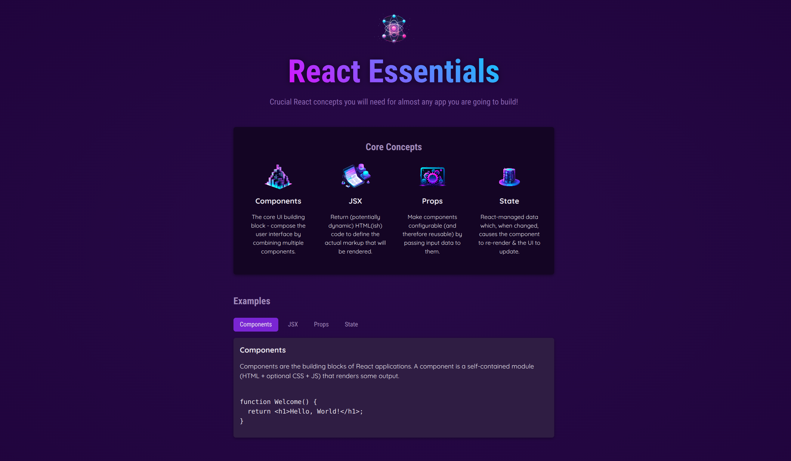

# React Core Concepts App

This is an educational React app built while following the ["React – The Complete Guide"](https://www.packtpub.com/en-us/product/react-the-complete-guide-includes-hooks-react-router-and-redux-9781801812603) video course by Maximilian Schwarzmüller, published by Packt.

The app demonstrates fundamental React concepts such as components, JSX, props, and state, and is intended for personal learning.

## Features

- **Component-Based Architecture**: Learn how to create reusable and modular components.
- **State Management**: Understand how to manage state using React's `useState` hooks.
- **Props**: Explore how to pass data between components using props.
- **Event Handling**: Implement event listeners and handlers in React.
- **Conditional Rendering**: Learn how to render components conditionally based on application state.
- **Lists and Keys**: Work with dynamic lists and understand the importance of keys.

## Screenshots

